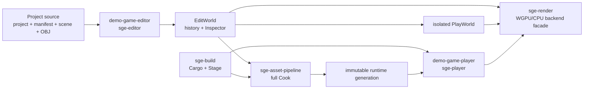
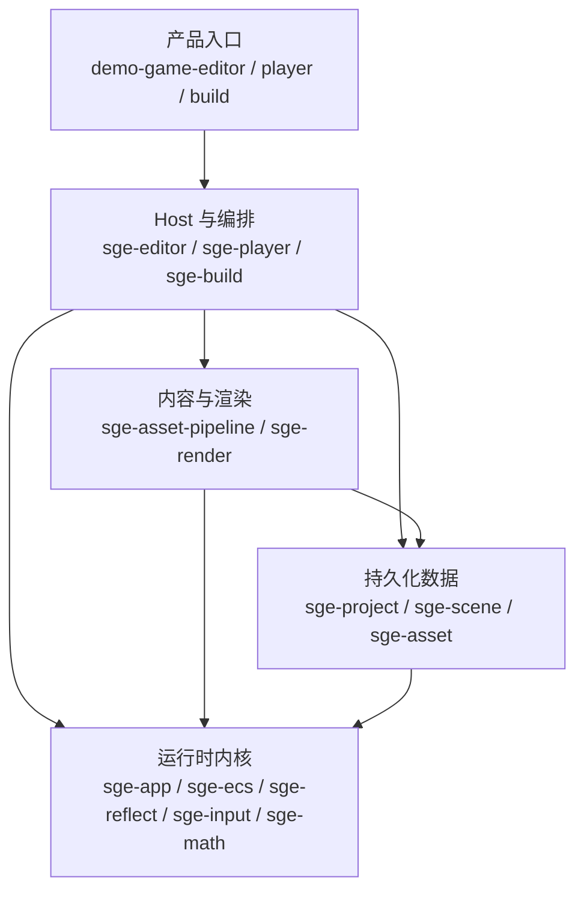

# SimpleGameEngine 架构

最后审阅日期：2026-07-13

本文是当前 Rust workspace 的架构真值，描述 crate 职责、依赖方向、产品路径和长期约束。当前完成度、验证证据与后续工作见 [`status.md`](status.md)。已经完成的阶段性设计和迁移计划不在当前树中维护，需要时通过 Git 历史查看。

## 命名规则

- `crates/` 下的 engine package 统一使用 `sge-*` 名称，目录名与 Cargo package 名一致。
- Rust 代码中的 crate 标识符由 Cargo 自动把连字符转换为下划线，例如 `sge-render` 对应 `sge_render`。
- `examples/demo_game/` 下的 `demo-game*` package 是具体游戏的 composition root 和产品入口，不属于通用 engine API。
- package 按职责拆分，不按每个数据类型或未来子系统拆分；没有真实调用方的音频、物理、网络等能力不预建空 crate。

## 产品与数据流

Editor、Build 和 Player 使用同一个静态 game library、`GameDescriptor`、typed World、Reflect registry、scene validation、runtime asset store 与 render extraction。WGPU/CPU 后端共用 `RenderSnapshot`、`RenderView`、`RuntimeAssetStore` 和投影逻辑；Editor 使用 eframe 拥有的 WGPU context 显示两种后端结果，Player 由 `sge-render::SurfaceRenderer` 拥有 surface/device/queue/config，CPU 路径只借该 presentation 层上传和合成最终 RGBA 帧。

## 分层关系

箭头表示允许的总体依赖方向。具体禁止依赖由 Cargo manifests 和 `scripts/audit-boundaries.sh` 共同约束；不得通过 facade、adapter 或 mirrored write 绕过 owner。

## Crate 职责

| 路径 / package | 负责 | 不负责 |
| --- | --- | --- |
| `crates/sge-app/` / `sge-app` | `EngineApp`、`Plugin`、`GameDescriptor`、fixed schedules、time/input resources、Ready app initializer | window、renderer、Editor/Player ownership |
| `crates/sge-ecs/` / `sge-ecs` | typed `World`、opaque `Entity`、resource/query、受限 `WorldInitializer` | scene 格式、Reflect metadata、host 任意可变 seam |
| `crates/sge-reflect/` / `sge-reflect` | frozen metadata、codec、clone、validation、reference semantics、DTO mutation/default construction | ECS storage、Inspector UI |
| `crates/sge-input/` / `sge-input` | 平台无关的逐帧 `InputFrame` | winit/egui event adapter、action remapping UI |
| `crates/sge-math/` / `sge-math` | `Transform` 与 glam 数学类型边界 | ECS storage、scene ownership |
| `crates/sge-asset/` / `sge-asset` | `AssetId`/`AssetRef`、`MeshAsset`、runtime catalog/content/store | source import、Cook、GPU handles |
| `crates/sge-project/` / `sge-project` | project identity、portable path/root、authoring manifest、atomic single-file I/O | importer、Editor session、multi-file transaction |
| `crates/sge-scene/` / `sge-scene` | authoring/runtime scene、`SceneName`、prepare/instantiate/snapshot | project/Cook I/O、GPU、Editor history |
| `crates/sge-asset-pipeline/` / `sge-asset-pipeline` | canonical OBJ import、rebuildable cache、dependency closure、full Cook、immutable generation publication | Editor/Player host、GPU、第二 importer facade |
| `crates/sge-render/` / `sge-render` | reflected render components、owned `RenderSnapshot`、共享投影、窄 backend facade、retained WGPU 与 CPU 光栅器、safe surface | project/source ownership、egui ownership、第二套 snapshot/store/host |
| `crates/sge-player/` / `sge-player` | identity-first source-free `PlayerSession`、winit presentation/input loop、resize/occlusion/surface policy | project、OBJ parser、Editor、native dialog |
| `crates/sge-editor/` / `sge-editor` | candidate open、`EditSession`、Inspector/history/save、authoring viewport/gizmo、isolated `PlaySession`、egui input routing、eframe host | arbitrary World mutation、第二 registry/backend/event loop、Play writeback |
| `crates/sge-build/` / `sge-build` | bootstrap launcher、full Cook/Cargo 编排、immutable Stage generation、atomic current manifest | game logic、Editor UI、Player runtime |
| `examples/demo_game/game/` / `demo-game` | 静态 game composition root、`Rotator`/`PlayerController` systems、固定类型注册 | engine 通用 shortcut |
| `examples/demo_game/{editor,player,build}/` | game-specific 薄产品入口与 native integration | 复制 engine owner 或数据格式 |

旧 C++、bare Rust prototype package、旧 sample、第二套 ECS/schema/OBJ importer/WGPU pipeline 已删除。它们不是当前兼容目标，回归门禁会拒绝重新引入。

## 持久化与运行时边界

- `project.sge.ron`、`Content/asset_manifest.ron`、`Scenes/*.scene.ron` 是 authoring truth。
- project `Cache/` 是可删除重建的 import cache，不是 durable truth。
- Editor 负责 source、manifest 与 candidate scene 的跨文件工作流：新 source 采用 create-only atomic write；后续 import/cache、prepare/instantiate 或 manifest atomic save 失败时删除该 source，既有 manifest、scene 与 live session 不提交候选状态。
- Basic Shapes 仍是普通 manifest/source/`AssetId` 资产；同一项目内以 importer settings 与规范 OBJ 字节匹配并复用，不建立内建 mesh 旁路。Undo/Redo 只改变 scene entity，已提交资产保持持久可复用。
- full Cook 发布 immutable generation 与单个 atomic runtime catalog。
- Player 只读取 runtime catalog、entry `RuntimeScene` 和 canonical `MeshAsset` products。
- runtime `Entity`、absolute path、Editor state、GPU handle 和 cache path 不进入 authoring/runtime scene。
- durable format 严格版本化并 fail closed；当前不承诺旧 prototype 格式兼容。

## Editor 与 Play

- `EditWorld` 是唯一 live authoring truth；mutation 从 snapshot 构造 fresh candidate，通过 validation/instantiate 后原子替换。
- Inspector、entity/component operation、gizmo commit 和文件操作统一进入 `EditSession` history，不维护 mirrored DTO。
- authoring viewport 拥有独立 editor camera；grid/axis、ViewCube、selection 和 gizmo 不修改 scene camera。scene Camera 与 Directional Light 仍是带 `Transform` 的普通场景实体，viewport 只为它们绘制可拾取的 editor-only 三维线框（camera body/frustum、light source/direction），不注入 `MeshRenderer`、runtime asset 或 Player draw item。
- 1280×720 顶栏只显示 compact project identity，完整路径通过 hover 保留；viewport 显式显示 active tool/Game View，错误条在 central viewport 布局前占位并可关闭。
- `PlaySession` 每次从同一 `GameDescriptor` 创建 fresh World；Stop 直接丢弃且不写回 `EditWorld`。
- game-specific Editor 独占 native dialog 依赖；dirty scene replacement 与窗口关闭必须经过 Save/Discard/Cancel。确认modal保留并禁用背景Editor，Save失败保持窗口、EditWorld、selection与history可恢复，Discard不写盘，Cancel不改变session。
- Editor 只把 Play viewport 已聚焦且未被 egui 消费的输入发送给 gameplay。
- authoring viewport 的 framing、tool hotkey 与飞行键盘输入同样要求 viewport focus 且无 text edit focus；Play 与 Build 互斥，Build child尚未回收时host禁止authoring mutation、文件写入和project/scene replacement。

## Render、Player 与 Stage

- extractor 从 typed World 复制出 owned、确定排序的 `RenderSnapshot`。
- active camera、projection、mesh asset 和 GPU target 错误均 typed fail，不静默恢复。
- `BackendRenderer` 只选择执行路径，不拥有 scene 或 asset truth；切换后端不会重建、写回或修改场景数据。
- WGPU mesh cache 以 `AssetId` retained；direct surface 与 offscreen/composite 共享 mesh draw path 和 depth policy。
- CPU 后端直接读取同一个 `RuntimeAssetStore`，先顺序生成屏幕空间三角形，再由 Rayon worker 对互不重叠的水平 tile 并行执行光栅化、透视校正法线插值、深度测试、alpha blend 与首个方向光 Lambert 光照。每个 tile 仍按 snapshot 三角形顺序处理，因此无需 framebuffer 锁或跨线程合并，并保持单线程/多线程输出一致；完成后的 RGBA 帧交给既有 presentation 层。Editor CPU 预览以 viewport 逻辑像素为光栅目标并由合成层缩放，避免 Retina 的平方级像素放大阻塞输入；WGPU 预览与 Player surface 仍按物理像素工作。
- Editor 顶栏实时选择 WGPU/CPU；Player 使用 `--backend wgpu|cpu`，默认 WGPU。该选择是 host session 状态，不进入 project、authoring/runtime scene 或 Cook/Stage 数据。
- `sge-render::FramePerformanceMonitor` 是唯一会话级性能采样 owner：固定保留最近240个已完成帧间隔，汇总FPS、p50/p95/max、60/30 FPS预算超限、advance/extract/render CPU wall time和surface跳帧。Player在同一redraw链路聚合完整帧；Editor分别显示UI thread的Play advance/extract与eframe callback的Preview prepare/paint，不伪造跨线程帧关联。
- 性能数据只描述host侧CPU wall time和已完成/跳过的surface事实；WGPU command encoding、`present()`返回不代表GPU执行完成。本地监控状态不进入project、scene、Cook或Stage，也不通过GPU readback、timestamp query或遥测扩张边界。
- Player redraw 固定为 advance → extract/view → acquire → render → submit → present；只有 present 成功才累计 frame。
- `sge build` 通过 `ProjectBootstrap` 定位 game-specific Build target；目标进程重新验证 identity 并执行 full Cook。
- Editor 独占本次 Build 生命周期；Unix launcher 使用独立进程组，取消、关闭或 drop 会终止整棵 Cargo/Build 子进程树并回收直接子进程。
- Stage 保存 immutable Player/runtime generation，单文件 atomic manifest 是唯一 current pointer；staged Player 从 executable 同级 `runtime` 自定位。

## 验证与架构门禁

默认 gate：

- `cargo fmt --all --check`
- `cargo clippy --workspace --all-targets -- -D warnings`
- `cargo test --workspace --all-targets`
- `cargo build --workspace`
- `scripts/audit-boundaries.sh`

完整产品 gate 是 `scripts/test-integration-demo.sh`，覆盖 Editor authoring/Play、WGPU/CPU 切换、两种后端 surface readback、full Cook、Cargo Build、copied Stage 和 source-free staged Player。自动 smoke 只证明所覆盖路径能够运行，不替代 Mac 物理输入、视觉布局和长路径人工验收。

## 延期边界

音频、物理、动画、Gameplay UI、脚本、网络、Prefab、Advanced Render/VFX、AI/Navigation、Asset Streaming/Hot Reload、Localization/Telemetry 等待真实产品纵切。archive/Pak、compression/encryption、signing、installer、patch/DLC/chunk 与远程/交叉编译矩阵等待发行需求。Play writeback、多实例/网络 PIE、action remapping、dynamic ABI、parallel ECS、RenderWorld、incremental Cook 等待真实调用方或可测量的复杂度/性能触发。

延期能力不得预建空 crate、空 trait 或第二套临时架构。
