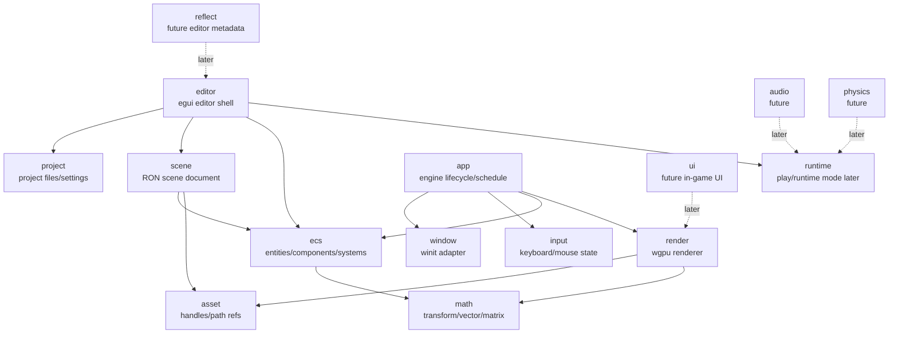
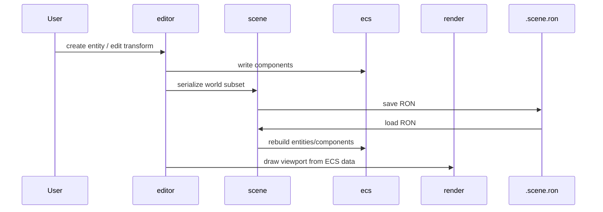
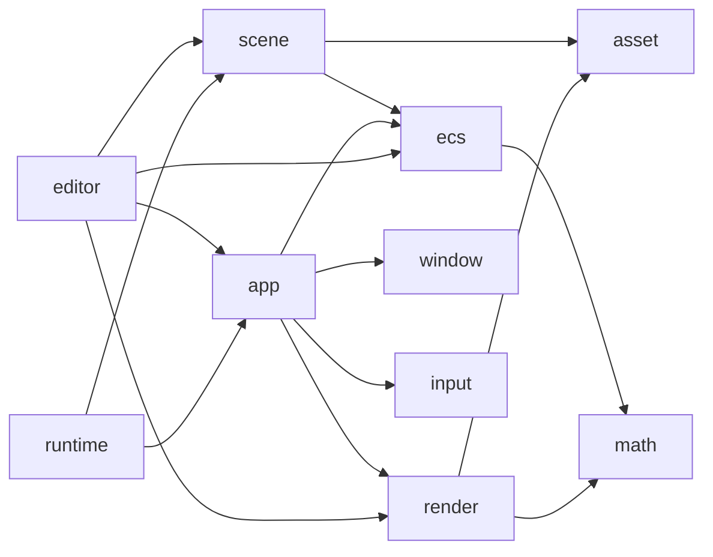
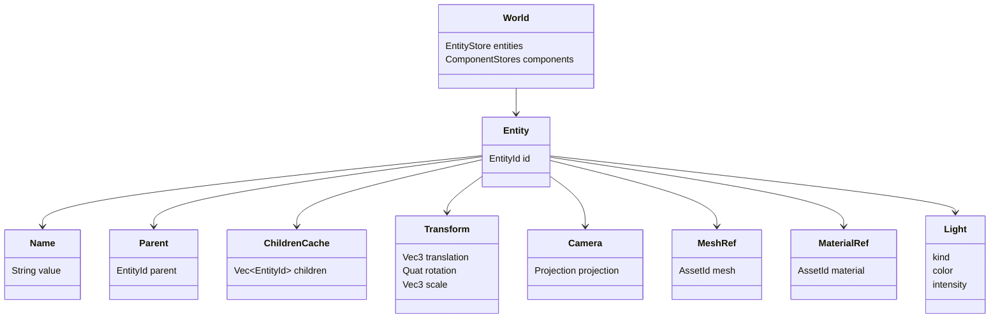
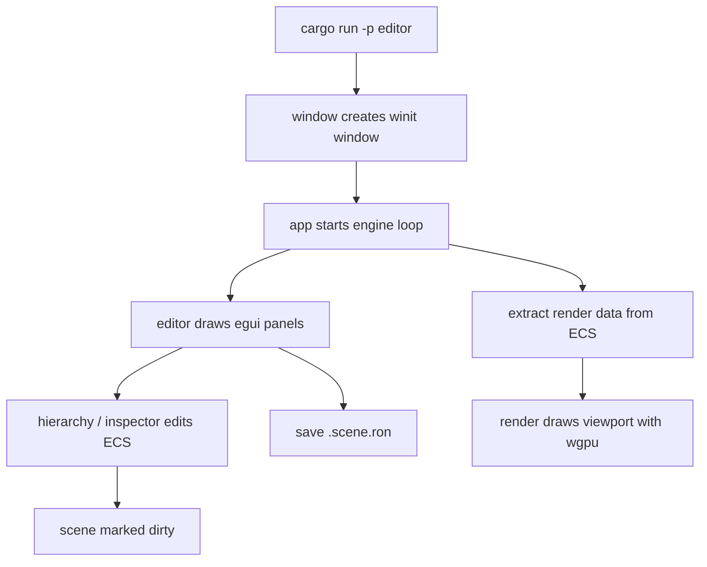
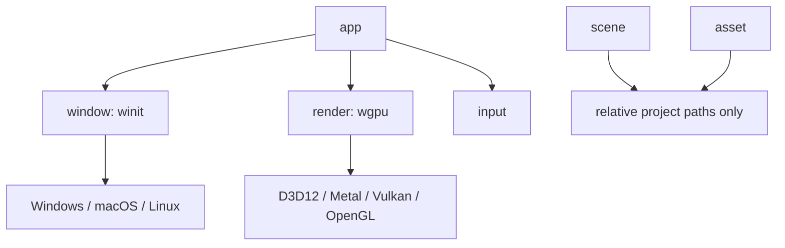
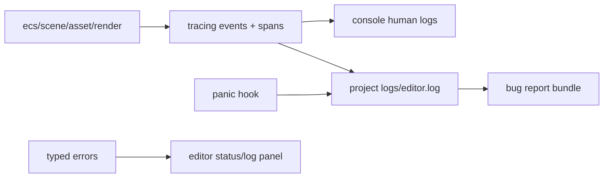
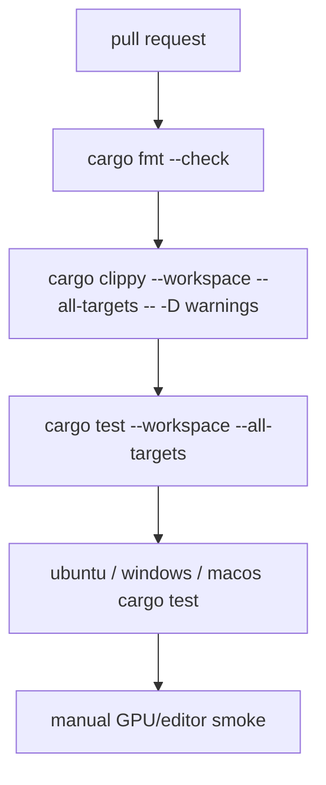

# Rust Game Engine Architecture Design

日期：2026-07-06

> 状态：已由 `2026-07-11-rust-engine-target-architecture-design.md` 取代。本文只保留 Rust reset 与 editor-first MVP 的历史决策，不再作为目标 crate、依赖、Reflect、Player、Cook 或 Play Mode 的设计真源。

## 结论

SimpleGameEngine 将从当前 C++ 软件渲染参考仓库切换为新的 Rust 游戏引擎仓库。旧 C++ 源码、CMake、CPM、GoogleTest、SDL C++ 示例、C++ CI 和 C++ 文档规则都进入删除或替换范围；如需参考旧实现，通过 Git 历史访问。

首个 MVP 是 editor-first 的 scene editor：

- 自研 Rust 核心。
- 架构参考 Bevy/Fyrox/Godot 的多模块分层，但不引入空壳 crate。
- 使用自研最小 ECS 作为 runtime 真源。
- 使用 `egui + winit + wgpu` 做 native editor shell。
- 使用 `.scene.ron` 作为首版场景保存格式。
- 首版渲染只做 wgpu 最小 mesh/camera viewport。
- 首版不做脚本、Prefab、glTF 导入、完整 asset database、in-game UI、音频和物理。

## 参考项目

参考对象只作为分层和边界来源，不照搬功能规模：

- Bevy：多 crate workspace、`app/ecs/asset/render/window/input` 等边界。
- Fyrox：Rust 引擎加 scene editor 的仓库组织。
- Godot：`core/editor/platform/scene/servers/modules` 这类大型引擎分层。
- Hazel：engine/editor/sandbox 分离的学习型引擎组织。

## 总体架构



首版编辑闭环：



## Workspace Layout

第一版目录：

```text
.
├── Cargo.toml
├── rust-toolchain.toml
├── crates/
│   ├── app/
│   ├── ecs/
│   ├── math/
│   ├── asset/
│   ├── scene/
│   ├── render/
│   ├── window/
│   ├── input/
│   ├── editor/
│   └── runtime/
├── assets/
│   ├── primitives/
│   └── examples/
├── examples/
│   └── editor_smoke/
├── docs/
│   ├── architecture/
│   └── superpowers/specs/
├── tests/
│   └── scene_roundtrip.rs
├── .github/workflows/
└── README.md
```

Crate 不使用 `sge_` 前缀。仓库名已经提供项目身份，crate 名只表达职责。

### 首版 crate

| crate | 职责 |
| --- | --- |
| `app` | engine lifecycle、main loop、schedule glue |
| `ecs` | 自研最小 ECS：entity、component storage、query、system |
| `math` | transform、vector、matrix、quaternion 类型或薄封装 |
| `asset` | primitive asset、file reference、handle/id |
| `scene` | `.scene.ron` save/load，world subset 序列化 |
| `render` | wgpu init、viewport mesh render、camera |
| `window` | winit window/event adapter |
| `input` | keyboard/mouse state |
| `editor` | egui panels、hierarchy、inspector、viewport |
| `runtime` | 运行入口边界，首版不做脚本和 gameplay framework |

### 暂缓 crate

| crate | 暂缓原因 |
| --- | --- |
| `reflect` | 没有脚本和复杂 Inspector 前不需要 |
| `ui` | editor 用 egui；in-game UI 不是 MVP |
| `audio` | scene editor MVP 不需要 |
| `physics` | 没有 gameplay 前不做 |
| `script` | 首版明确排除 |
| `importer` | glTF/import pipeline 首版不做 |
| `tools` | 没有 CLI 需求前不建 |
| `platform` | 文件对话框、剪贴板、native menu 出现真实需求后再建 |

新 crate 必须有实际 public API 和测试，不创建只有名字的空壳 crate。

## Dependency Rules



Hard rules:

- `math` does not depend on other internal crates.
- `ecs` does not depend on `scene`, `render`, or `editor`.
- `scene` only serializes and deserializes saveable data.
- `render` receives prepared render data; it does not own editor data structures.
- `editor` is a composition layer and can depend on higher-level crates.
- `runtime` starts thin and stays separate from editor-only state.

## Core Data Model

首版只建 scene editor 需要的数据，不做完整反射、脚本和 Prefab。



ECS 是真源：

- editor hierarchy 从 `Parent` 和 `Name` 组件投影出来。
- Inspector 直接编辑组件数据。
- Viewport 从 ECS 读取 `Transform + MeshRef + MaterialRef + Camera/Light` 子集，再交给 `render`。
- `Parent` 是持久化真源；`Children` 是加载后由 `Parent` 重建的运行时缓存，不作为普通可保存组件。
- ECS 首版不做 archetype、不做并行调度、不做 change detection。

`.scene.ron` 保存 ECS 可保存子集，不保存 GPU 资源、窗口状态、editor panel 状态。

示例：

```ron
Scene(
  entities: [
    Entity(
      id: "root",
      name: "Root",
      components: [
        Transform(
          translation: [0.0, 0.0, 0.0],
          rotation: [0.0, 0.0, 0.0, 1.0],
          scale: [1.0, 1.0, 1.0],
        ),
      ],
    ),
    Entity(
      id: "camera",
      name: "Camera",
      components: [
        Parent(parent: "root"),
        Transform(
          translation: [0.0, 2.0, 5.0],
          rotation: [0.0, 0.0, 0.0, 1.0],
          scale: [1.0, 1.0, 1.0],
        ),
        Camera(projection: Perspective(fov_y_degrees: 60.0)),
      ],
    ),
    Entity(
      id: "cube",
      name: "Cube",
      components: [
        Parent(parent: "root"),
        Transform(
          translation: [0.0, 0.0, 0.0],
          rotation: [0.0, 0.0, 0.0, 1.0],
          scale: [1.0, 1.0, 1.0],
        ),
        MeshRef(asset: "primitive:cube"),
        MaterialRef(asset: "primitive:default_material"),
      ],
    ),
  ],
)
```

## Editor, Runtime, Render Flow

Editor flow:



Runtime first version:

```text
runtime loads .scene.ron
-> builds ecs World
-> app loop ticks
-> render displays scene
```

首版不做 Play-in-editor、脚本、热重载和 gameplay framework。

## Cross-Platform Strategy

目标平台是 Windows、macOS、Linux。首版只承诺源码结构和 CI 覆盖三平台，不在没有 smoke 证据时声称 GUI 行为完全一致。



Rules:

- OS-specific window and event details stay inside `window`.
- GPU adapter, surface, backend, and shader details stay inside `render`.
- Scene and asset files store project-relative paths only.
- CI passing means build/test coverage, not full editor usability.
- Linux X11/Wayland and GPU driver behavior requires explicit smoke evidence.

## Docker And Development Environment

Docker and Dev Container are the default path for build, test, lint, and CI-like verification. Running the GUI editor inside Docker is optional and platform-dependent, not the default promise.

| Scenario | Decision |
| --- | --- |
| `cargo fmt`, `cargo clippy`, `cargo test`, `cargo check` | Default through Dev Container |
| Linux with GPU and X11/Wayland socket | Optional editor smoke path |
| macOS/Windows Docker Desktop GUI editor | Not a default path |
| Real editor usage | Prefer host-native binary or explicit opt-in host Rust setup |

Host dependency rule stays strict: do not install toolchains on the macOS host by default. If host-native editor execution is needed, ask first or document it as an opt-in path.

Toolchain policy:

- `rust-toolchain.toml` uses `channel = "stable"`.
- The repository follows stable Rust instead of pinning an exact compiler.
- `Cargo.toml` still records an MSRV only when the implementation chooses one deliberately.

## Logging, Errors, And Bug Reports

Use `tracing` as the unified logging and diagnostics layer. Library crates emit events and spans but do not initialize global logging. `editor` and `runtime` initialize subscribers.



Error policy:

- Library crates use typed errors, likely via `thiserror`.
- Binary crates may use `anyhow` with context for top-level flow.
- Expected user or IO failures return `Result`.
- Normal absence returns `Option`.
- Panics are reserved for invariant bugs.
- `render` labels wgpu resources and spans adapter/surface initialization.

Bug report bundle contents:

- App version and Git commit if available.
- OS and architecture.
- GPU adapter and wgpu backend when available.
- Scene file or minimized reproduction scene.
- Recent log file.
- User reproduction steps.

The bundle must avoid leaking secrets, environment dumps, or personal absolute paths by default.

首版不做 telemetry、remote crash upload, or analytics.

## Automated Testing

CI uses GitHub-hosted runners for Ubuntu, Windows, and macOS where practical.



Test layers:

| Layer | Scope |
| --- | --- |
| Unit | `ecs` component/query, `math` transform, `asset` resolve |
| Integration | `.scene.ron` save/load roundtrip |
| Render headless | render data extraction and resource descriptor tests without a real window |
| Editor smoke | Manual host-native smoke or optional self-hosted GPU runner: open window, create cube, save, reopen |
| Release gate | fmt, clippy, and test must pass automatically; GUI editor smoke is recorded evidence, not the default automatic gate |

## Completion Definition

The first implementation phase is complete when:

- C++/CMake/GoogleTest/CPM/SDL C++ structure is removed or replaced.
- Rust workspace builds inside the Dev Container.
- CI runs Rust fmt, clippy, and tests.
- Manual host-native editor smoke, or optional self-hosted GPU runner smoke, proves that `editor` opens a window with hierarchy, inspector, and viewport.
- The same GUI smoke proves that a user can create at least one cube entity, edit transform, save `.scene.ron`, reopen it, and see a minimal mesh/camera result through wgpu.

## Explicit Non-Goals

- No script system.
- No Prefab.
- No glTF/import pipeline.
- No complete asset database.
- No in-game UI.
- No audio.
- No physics.
- No remote telemetry or crash upload.
- No host toolchain installation by default.
