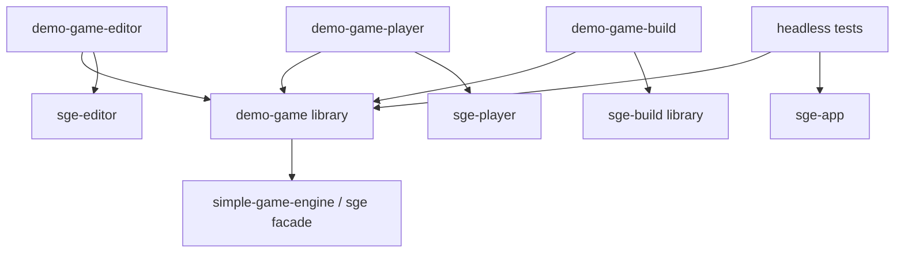
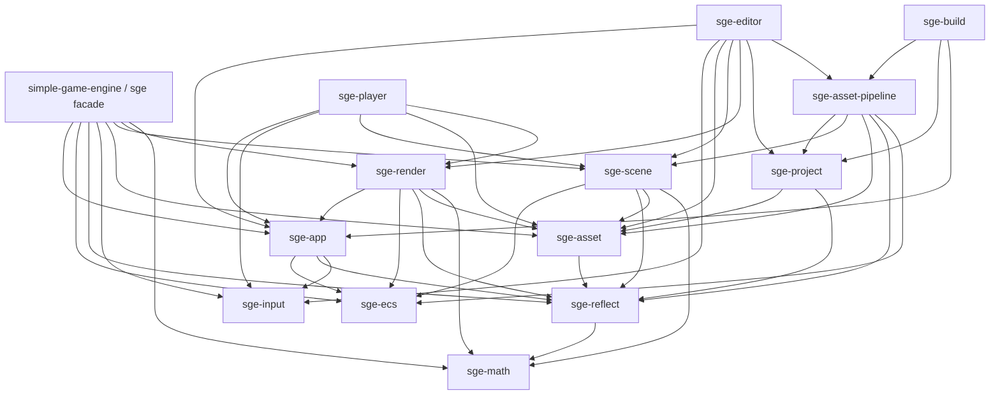
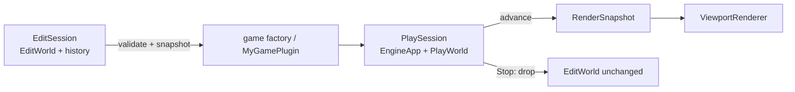

# Rust Engine Target Architecture Design

日期：2026-07-11

状态：已批准，作为 SimpleGameEngine 的目标架构真源。

本文件取代 `2026-07-06-rust-engine-architecture-design.md` 作为 SimpleGameEngine 的目标架构真源。旧文档只保留 Rust reset 与 editor-first 历史背景。

本文件描述目标状态，不代表当前代码已经实现。当前 workspace、命令和验证证据仍以 `README.md`、`docs/architecture/overview.md`、Cargo manifests 和源码为准。

## 结论

SimpleGameEngine 采用自研、窄而完整的 Rust 游戏引擎架构：

- 自研最小 ECS、Reflect 和 EngineApp，而不是把 Bevy 作为隐藏内核。
- 每个游戏拥有一个原生 Rust game library；同一份游戏代码静态链接到 game-specific Editor、Player、Build target 和 headless tests。
- Editor、Player、Build 是三个不同产品，Runtime/Core 不反向依赖 Editor 或 Build。
- Editor 的 Edit World 与运行中的 Play World 隔离。
- authoring source、imported product、cooked runtime product 和 staged distribution 分层。
- Player 只读取 cooked runtime data，不解析 OBJ 等源格式。
- 当前只使用一个 WGPU renderer，不预建多 backend 抽象。
- 不创建未来占位 crate；完整度由所有权、合同和端到端数据流闭合定义，不由 crate 数量定义。

目标架构全部落地后，再完成一个只使用公开合同、串联全部已实现能力的 demo game。

本轮明确不要求：

- 兼容当前 `.scene.ron`、`project.sge.ron`、asset manifest 或公共 Rust API。
- 提供旧格式迁移器、兼容 adapter 或双写路径。
- 建立性能基线、性能回归门槛或优化里程碑。
- 现在实现音频、物理、动画、runtime UI、脚本、网络等尚无用户目标的功能子系统。

不做性能评估不等于省略正确的资源所有权。GPU buffer、runtime asset 和 Play World 仍必须拥有明确生命周期，但不设置 FPS、帧耗时、分配次数或吞吐量指标。

## 架构完整性的定义

本阶段所说的“完整架构”是 engine/editor/runtime spine 完整，不是所有可能游戏功能都已实现。

以下边界必须形成真实实现和自动化验证，目标架构才算完成：

1. game library 同时组合进 Editor、Player、Build target 和 headless tests。
2. EngineApp 拥有 World、Resources、TypeRegistry、固定 schedules 和时间推进。
3. ECS 支持游戏自定义 typed components、resources、query 和 serial systems。
4. Reflect 支持 Inspector、通用 undo、scene save/load 和 cook validation。
5. project、authoring scene、runtime scene 和 game identity 有明确合同。
6. source asset、import cache、Cook、runtime catalog 和 Stage 完成闭环。
7. Editor Edit World、Play World 和 gameplay input 相互隔离。
8. Editor viewport 与 Player 使用同一 render extraction 和 WGPU renderer。
9. Build Tool 可以构建 game-specific Player 并生成自包含 Stage。
10. 错误、路径、引用、层级和数据版本验证在所有入口 fail closed。

音频、物理等延期功能只需要明确未来通过何种通用边界接入；当前不为它们创建专用 API、trait、component 或 crate。

## 设计依据与取舍

目标架构综合采用以下成熟边界，但不复制其规模：

- Jason Gregory：核心服务、运行时子系统、资源管线和工具链分层。
- Unreal Engine：Target/Module 产品组合、独立 Play World、Cook/Stage/Package 边界。
- Fyrox：同一份 game plugin 进入 editor、executor 和 headless。
- Bevy：App、Plugin、Schedule 和 owned render extraction 的合同形态。
- Godot：source import cache、scene product 和 export product 分层。
- O3DE：reflection 与 asset pipeline 是跨工具和 runtime 的公共数据合同。

不采用：

- Bevy 完整 facade、SubApp、RenderWorld 或任意 schedule graph。
- Unreal UObject、BuildGraph 或完整 PIE 模式。
- Fyrox 动态库热重载和胖 PluginContext。
- O3DE Asset Processor daemon、数据库 catalog 或分布式缓存。
- Godot 全局 singleton server/object model。

## 产品与游戏组合

### 三个产品

```text
Game Editor
Game Player
Build Tool
```

硬依赖方向：

```text
Editor/Build -> Runtime/Core
Player       -> Runtime/Core
Runtime/Core -X-> Editor/Build
```

### Game library

每个游戏使用普通 Rust library crate：

```text
demo-game/
├── game/       # components, resources, systems, MyGamePlugin
├── editor/     # game-specific Editor binary
├── player/     # game-specific Player binary
├── build/      # game-specific Cook/Build binary
├── project.sge.ron
└── Content/    # authoring source
```

`game/editor/player/build` 使用独立 Cargo package。不能只在同一 package 中放多个 binary，因为 package 级依赖和 feature 会让 `eframe`、`rfd`、source importer 或 Build 依赖泄漏到 Player。

game library 同时静态链接到：

```text
demo-game-editor
demo-game-player
demo-game-build
demo-game headless tests
```

第一阶段不使用 Rust dynamic plugin ABI。一个已经运行的 game-specific Editor 只能打开 `game_id` 与已编译 game library 匹配的 project。当前直接运行明确的 game-specific Editor package，不建立通用 project launcher，也不能在同一进程内替换另一套 Rust 游戏代码。

### Game descriptor 与唯一 factory

`GameDescriptor` 合同类型由下层 `sge-app` 定义并由 facade re-export。game package 只负责构造一个静态 descriptor，至少包含稳定 `game_id` 和创建已配置 EngineApp 的函数：

```text
GameDescriptor
├── game_id
└── create_app() -> Result<configured EngineApp, EngineBuildError>
```

`create_app` 每次都创建空 World，注册默认 runtime plugins 和同一个 `MyGamePlugin`，然后冻结 registry。它不创建窗口、GPU、Editor state，也不读取 project。

三条使用路径必须复用该 factory：

- Editor 创建一个 authoring EngineApp，载入 authoring scene，但不调用 `advance`；EditSession 使用其中的 World 和 TypeRegistry。
- 每次进入 Play 都重新调用 factory，实例化 snapshot，然后开始调用 `advance`。
- Player 调用 factory、实例化 cooked runtime scene，再开始调用 `advance`。
- game-specific Build target 调用 factory 取得同一 TypeRegistry 与只读 World registration surface，
  执行自定义组件验证、实例化预检和 Cook。
- headless tests 调用 factory、构造测试 World/InputFrame 并直接调用 `advance`。

game-specific binary 在 composition root 把 descriptor 显式传给 `sge_editor::run`、`sge_player::run` 或 `sge_build::run`。可复用 host 只依赖 `sge-app` 中的合同，永远不依赖具体 game crate。

因此不再建立第二套 schema builder、Editor-only component registry 或胖 `GameFactory` framework。factory 可以是普通函数指针或闭包合同，不要求新的 crate。

## Product target 静态组合

下图每个矩形都是 Cargo package 或该 package 中的 test target，箭头表示 Cargo dependency/静态链接，不表示进程启动：



通用 `sge` 是 `sge-build` package 内的另一个 binary target。它通过子进程构建并启动 `demo-game-build`，两者之间不是 Rust library dependency。

## Engine package 依赖图

下图只包含 engine library packages，箭头表示允许的直接 Cargo dependency。`sge-*` 是目标 package 名；迁移时只有在对应职责和调用方真正落地的里程碑才重命名或创建，不先做纯命名改造。



该 package 依赖图必须保持无环。功能子系统只能依赖 Core，不允许 Core 为未来功能反向增加依赖。
`sge-asset-pipeline -> sge-ecs` 的直接边只用于 Full Cook 在发布前读取同一 Ready app 的 World
component registration surface，并对 exact cooked scene执行无 mutation的实例化预检；不得因此复制
第二套 component registry、TypeId set或 World。Player dependency audit 的对象是最终
`demo-game-player` binary 的完整 Cargo dependency closure，而不只是 `sge-player` package。

## 目标 crate 职责

| package | 负责 | 禁止负责 |
| --- | --- | --- |
| `sge-math` | 数学基础类型和运算 | ECS、scene、GPU、平台事件 |
| `sge-reflect` | 稳定 type/field key、字段元数据、反射值、codec/clone/validation descriptor、TypeRegistry | egui、任意方法调用、GC、动态模块加载 |
| `sge-ecs` | runtime Entity、typed component storage、typed Resources、query、serial system 基础 | scene 格式、render、Editor、项目文件 |
| `sge-app` | EngineApp lifecycle、固定 schedules、Plugin 注册、time accumulator、系统执行 | winit、eframe、wgpu、source import、Editor session |
| `sge-input` | 平台无关的每帧 input snapshot | 原始 winit/egui events、窗口所有权 |
| `sge-asset` | 正式 AssetId、runtime asset catalog、runtime products、加载状态 | OBJ/PNG/WAV source 解析、native dialog、项目 authoring workflow |
| `sge-scene` | authoring scene DTO、runtime scene product、World snapshot/instantiate、scene validation | GPU、Editor panel/session、文件对话框 |
| `sge-project` | project descriptor、project root、game/package identity、路径 containment | EditorModel、runtime tick、asset importer |
| `sge-asset-pipeline` | source importer、import cache、全量 Cook、runtime dependency closure、cooked content 生成 | Player runtime、窗口/UI、Cargo game build |
| `sge-render` | render components、World extraction、owned RenderSnapshot、唯一 WGPU backend、GPU asset cache | source importer、project path、egui ownership、多 backend facade |
| `sge-editor` | eframe host、EditSession、PlaySession、panels、Inspector drawers、gizmo、文件和 build UI | ECS storage 实现、第二个 winit loop、游戏代码所有权 |
| `sge-player` | winit host、surface、input adapter、持续 runtime loop | eframe、rfd、source importer、Undo/Redo、project authoring、Cook |
| `sge-build` | 接收 GameDescriptor 执行 Cook/Stage/Cargo 编排；同 package 提供通用 `sge` launcher | 游戏逻辑、Editor state、runtime renderer |
| `simple-game-engine` | import 名 `sge`；精选 game-facing API 和默认 runtime plugin 组合 | Editor、Build、source importer API |

`sge-editor` 和 `sge-player` 是可复用 host library；真正的 binary 位于 game-specific package。`sge-build` library 由 game-specific Build binary 调用，同 package 的通用 `sge` binary 只负责定位并启动正确 target，不另建空壳 `sge-cli`。

Editor 的 build/export UI 以子进程启动通用 `sge build`，不直接依赖 `sge-build` library；Cook 只存在于 game-specific Build 进程中。

## EngineApp、Plugin 与 Schedule

### 所有权

`EngineApp` 拥有：

```text
EngineApp
├── World
│   ├── typed component storages
│   └── typed Resources
├── TypeRegistry
├── Startup schedule
├── FixedUpdate schedule
├── Update schedule
├── PostUpdate schedule
└── time accumulator
```

窗口、GPU surface、Editor session、文件对话框和 project source 不属于 World 或 EngineApp 所有权。

### 生命周期

```text
Configuring
-> finish registration
-> Ready
-> first advance runs Startup once
-> Running
-> host drops EngineApp / PlaySession
```

`finish` 后 component、resource、reflect type 和 system 注册冻结。重复 type key、缺失注册、无效 schedule 目标等错误必须在 `Startup` 前返回。

### Plugin

最小合同：

```rust
trait Plugin {
    fn build(&self, app: &mut EngineApp) -> Result<(), RegistrationError>;
}
```

Plugin 只注册 component、resource、reflect descriptor 和 systems。执行顺序由显式添加顺序和固定 schedule 决定。

当前不建立：

- Plugin 自动依赖解析。
- PluginGroup framework。
- service locator 或胖 PluginContext。
- 动态 plugin ABI。
- 任意 schedule DAG。

### Host 驱动

host 向 `EngineApp::advance` 提供 delta 和平台无关的 `InputFrame`。EngineApp 自己执行固定步长累积、零到多个 `FixedUpdate`、一次 `Update` 和一次 `PostUpdate`。

eframe Editor、winit Player 和 headless test 都直接驱动同一个 `advance` 合同。当前不建立 `Runner` trait；只有出现需要由 Core 动态选择的多个可替换 runner 实现时才重新评估。

首版 system executor 串行运行，不做并行访问分析、job system 或 change detection。

## ECS 合同

### Entity identity

- runtime `Entity` 是不透明、可检测陈旧句柄的运行时 identity。
- `SceneEntityId` 是持久化稳定 identity，用于 authoring scene、parent 和 entity reference。
- scene instantiate 建立 `SceneEntityId -> Entity` 映射。
- runtime Entity 不能直接写入磁盘。

`SceneEntityId` 和映射合同由 `sge-scene` 拥有，而不是让通用 ECS 承担持久化格式职责。需要在 runtime 查询稳定 ID 时，scene 可以把它作为普通已注册组件实例化。

### Storage 与 Resources

- component 通过 typed API 存取，底层可使用 `TypeId -> erased storage`。
- Resources 使用独立 typed map，但仍由 World 拥有。
- ECS 不硬编码 Camera、Mesh、Light 或游戏组件。
- ECS 不依赖 scene、render 或 editor。
- 公共 mutation API 不能绕过 entity lifetime 和 storage invariants。

首版不做 archetype、并行 query、change detection、事件总线或 command bus。系统执行期间若需要延迟结构变更，只增加满足真实 system 调用的最小 command queue，不预建通用消息框架。

## Reflect 合同

Reflect 是游戏自定义组件跨 runtime、Editor、scene 和 Cook 的桥梁，因此属于当前必需内核，不再延期。

每个可 authoring/save 的组件至少注册：

- 稳定 type key。
- 当前 schema version。
- 稳定 field key 和显示元数据。
- serialize/deserialize callbacks。
- clone/snapshot callbacks。
- component-level 和 field-level validators。
- 可选的 reference semantic，例如 Entity 或指定类型 Asset 引用。

首版反射值只支持当前 demo 需要的有限集合：

- bool、整数、浮点数、String。
- Vec、Quat、颜色。
- enum。
- Entity reference。
- typed Asset reference。

`sge-reflect` 依赖叶子 `sge-math`，直接使用统一的 Vec/Quat 等数学类型。Entity/Asset reference 在 reflect 中只保存 dependency-neutral payload 和 semantic metadata；具体 codec 由 `sge-scene`、`sge-asset` 等拥有 ID 类型的上层 crate 注册。`sge-reflect` 不反向依赖 SceneEntityId 或 AssetId，从而保持依赖图无环。

任意容器、方法反射、函数调用、对象生命周期、GC、网络 replication metadata 和脚本 ABI 均不进入首版。

TypeRegistry 由 EngineApp 拥有并在运行前冻结。未知 type key、重复注册、版本不匹配和无法反序列化均为硬错误；不得静默丢弃未知组件后继续保存。

默认 Inspector 读取字段 metadata。特殊 egui drawer 放在 `sge-editor` 的 drawer registry，`sge-reflect` 不依赖 egui。

Undo/Redo 使用通用 reflected field command 和 entity/component snapshot，不再为每个游戏字段增加 Editor command enum variant。

首批组件允许手写注册。只有多个真实组件出现稳定重复样板后才引入 derive/proc-macro，不能先创建宏 crate。

## Input 合同

`sge-input` 只定义平台无关的每帧 snapshot，例如 held/pressed/released buttons、pointer delta、wheel 和必要 axes。它不包装原始 winit 或 egui event。

- Player 将 winit events 转换为 `InputFrame`。
- Editor 先消费菜单、快捷键、gizmo、viewport camera 和 UI events。
- 只有未消费、Play viewport focused 的输入进入 gameplay `InputFrame`。
- headless tests 可以直接构造 `InputFrame`。

一个 `InputFrame` 的 pressed/released、pointer delta 和 wheel 只在当前 `advance` 有效；held state 对该次 `advance` 内的所有 fixed steps 可见。可能执行多次的 FixedUpdate 不应把 frame-scoped edge 当作“每个 fixed step 都发生一次”，需要离散动作时由游戏系统显式缓冲或消费一次。首个 demo 的连续控制读取 held state，边沿快捷动作放在 Update。

首版不建立完整 action remapping、手柄数据库或 input recording 子系统。真实游戏需要重绑定或多设备时，再在 `sge-input` 内增加能力，不另建平台 adapter crate。

## 平台边界

- Editor 的 native lifecycle 由 eframe 持有，不能再创建第二个 winit event loop。
- Player 的 native lifecycle、window 和 winit event adapter 位于 `sge-player`；它把 safe owned window
  handle provider（首版为 `Arc<winit::Window>`）交给 renderer，不拆出裸 handles，也不直接拥有 wgpu
  API。
- Player 的 WGPU instance/adapter/device/queue/surface和 GPU resources位于 `sge-render`。eframe Editor
  已由框架拥有 surface/device/queue，因此通过 callback把 borrowed GPU context交给同一个 renderer
  backend；pipeline/buffer/texture/runtime asset cache仍由 `sge-render`类型拥有，且 `sge-render`不依赖
  egui/eframe。
- project、scene、asset 和 Stage 不保存个人机器绝对路径。
- Build 按明确 Cargo target/profile 生成对应 Stage；没有 CI 或实机证据时不声称某个平台已支持。

目标平台仍是 Windows、macOS、Linux，目标架构是 x86_64、aarch64。架构中不建立通用 `sge-platform` facade；具体 OS 能力先留在拥有它的 host。

## Project 与静态游戏身份

project descriptor 至少包含：

```text
format_version
game_id
game package identity
player package identity
build package identity
default authoring scene
```

打开 project 时必须：

1. 解析 descriptor。
2. 验证所有路径位于 project root 内。
3. 比较 descriptor `game_id` 与当前 binary 编译进来的 game descriptor。
4. 加载 asset manifest 和 authoring scene。
5. 通过同一个 TypeRegistry 验证全部组件和引用。

错误 `game_id` 必须拒绝打开，不能尝试把另一套 Rust 组件数据交给当前 binary。

## Scene 数据模型

### Authoring scene

Authoring scene 是稳定 DTO，不是 ECS 内部存储的直接序列化：

```text
AuthoringScene
├── format version
└── entities
    ├── SceneEntityId
    ├── parent/reference data
    └── component records
        ├── stable type key
        ├── schema version
        └── registry-owned payload
```

保存时只提取注册为 saveable 的组件。GPU resources、runtime handles、窗口状态、selection、panel layout、undo history 和 PlaySession 不进入 scene。

内建组件按拥有者分布：Transform 等数学数据位于 `sge-math`，Name/Parent/SceneEntityId 等场景关系位于 `sge-scene`，Camera/Mesh/Material/Light 等渲染语义位于 `sge-render`。它们通过 Reflect 注册进入 scene，不能重新塞回固定 EntityRecord。Parent 写入优先经过 scene hierarchy API；外部文件或游戏代码造成的无效关系必须在共享 world validation 中失败。

### Runtime scene product

Cook 生成独立版本的 runtime scene product：

- 只包含 Player 需要的组件和 dependency references。
- 不包含 source path、import settings 或 Editor metadata。
- 通过 runtime catalog 引用 cooked assets。
- Player 通过同一个 component registry 实例化 World。

authoring 与 runtime scene 可以首版都使用 RON 编码，但必须是不同 Rust types、不同格式版本和不同文件角色。编码相同不能成为层次合并的理由。

当前不实现旧 scene migration。任何版本不匹配都给出明确错误。

## Asset、Import 与 Cook

### 数据层

```text
Authoring Source
-> importer
-> disposable Import Cache containing canonical runtime-ready products
   ├-> Editor RuntimeAssetStore -> authoring viewport / PlaySession
   └-> Cook + shared validation -> cooked products + Runtime Catalog -> Stage
```

具体边界：

- `SourceAssetRecord` 记录 project-relative source、import settings、稳定 AssetId 和 source 类型。
- import cache 保存可重建、runtime-ready 的 canonical CPU products，例如 `MeshAsset`；删除 cache 后可以从 source 全量恢复。
- `sge-asset` 定义唯一 `RuntimeAssetStore`。Editor 从 import cache 填充它，Player 从 cooked catalog/products 填充它；renderer 不区分 store 的填充来源。
- `RuntimeAssetCatalog` 只记录 Player 所需 cooked products、类型和 dependency closure。
- Renderer 只接收 AssetId 和 runtime mesh/material/texture product，不知道 OBJ 或 source path。
- Player 不依赖 `tobj`、native dialog、project authoring manifest 或 import settings。

Editor authoring viewport 不要求先 Cook。importer 把 OBJ 转换为与 Player 最终加载相同内存形态的 canonical `MeshAsset`，Editor 将它放入 session 的 RuntimeAssetStore。进入 Play 时，PlaySession 只共享或复制这些已导入的 immutable products，不重新读取 source。Cook 负责把相同 canonical products 编码成 distribution files 和 catalog；Player 只从这些 cooked files 重建 RuntimeAssetStore。

import cache 缺失或损坏时，Editor 可以显式重新导入；Play 和 Player 均不得回退到 source parsing。

首个 importer 可以仍然只有 OBJ，但必须位于 `sge-asset-pipeline`。不建立泛化 `sge-importer` crate；多个 source importer 共享稳定接口并出现独立调用方后再评估。

### 数据安全

- project、scene、manifest、catalog 和 cooked output 使用临时文件或临时目录后原子替换。
- manifest 或 scene 解析失败必须 fail closed，禁止 `unwrap_or_default` 后覆盖。
- source、imported 和 cooked path 必须是经过验证的 project-relative path。
- 必须拒绝绝对路径、`..` escape、重复 AssetId、类型不匹配和缺失 dependency。

### 首版 Cook

首版只做 deterministic full Cook：

1. 读取 project 和 authoring manifests。
2. 必要时重建全部 imported products。
3. 验证 scenes、components、entity references 和 asset references。
4. 计算 Player 入口 scene 的 runtime dependency closure。
5. 写出 runtime scenes、runtime asset products 和 catalog。
6. 原子发布 cook output。

当前不做增量图、后台 daemon、SQLite database、cook-on-the-fly 或分布式缓存。

## Render 数据流

```text
World + runtime AssetId
-> serial RenderExtractor
-> owned RenderSnapshot
-> retained GPU asset cache
-> WGPU surface/offscreen target
```

硬边界：

- `RenderSnapshot` 不借用 World，也不持有 EditorModel。
- extraction 只读取已注册的 render-facing components 和 runtime assets。
- Editor authoring viewport 和运行中的 Play viewport 使用同一 extractor。
- Player 使用同一 renderer；winit host只提供 safe owned window handle provider，surface由 renderer
  创建并拥有。
- egui WGPU callback bridge 位于 `sge-editor`，不能让 `sge-render` 依赖 egui。
- GPU pipeline、buffer、texture 和 runtime asset cache 由 renderer 拥有。
- 空 scene、缺失 asset、数据 overflow 和 GPU failure 使用不同 typed errors，不用单个 `Option` 混合表达。

当前只有 WGPU backend，保留单一 `sge-render` crate。不建立 renderer backend trait、`sge-render-wgpu`、RenderWorld、RenderGraph 或 SubApp。

## Edit World 与 Play World



`EditSession` 拥有：

- EditWorld。
- selection。
- undo/redo history 和当前 history cursor。
- saved cursor，而不是单独 dirty bool。
- editor-only viewport、gizmo 和 panel state。

进入 Play：

1. 对 EditWorld 运行共享验证。
2. 生成独立 runtime scene snapshot。
3. 通过同一个 GameDescriptor factory 创建 EngineApp，并由其中的 `MyGamePlugin` 完成注册。
4. 实例化独立 PlayWorld。
5. 由 eframe 每帧调用 `advance`。

停止 Play 时直接销毁 PlaySession。Play 对 entity、component 和 resources 的修改不回写 EditWorld。

首版不做 Play 修改回写、多实例 PIE、网络 PIE、simulate-in-place 或代码热重载。

## Build、Stage 与运行

`sge-build` 提供 library 和通用 `sge` launcher。因为自定义 component codec/validation 是静态 Rust 代码，通用 launcher 自身不能直接 Cook 任意游戏；真正 Cook 必须发生在链接了同一 game library 的 game-specific Build binary 中。

```text
sge build <project>
-> parse only bootstrap-safe project fields
-> cargo build game-specific Build package
-> execute demo-game-build with project path

demo-game-build
-> link demo-game + sge-build library
-> create EngineApp/TypeRegistry/World registrations from GameDescriptor
-> fully parse + validate project
-> full import/cook with custom component registry
-> cargo build game-specific Player package
-> stage executable + runtime catalog + cooked dependency closure
-> validate and atomically publish staged layout
```

Editor 的 build/export UI 启动相同 game-specific Build target，不能在 Editor 内复制一套 Cook 实现。以上是目标命令合同，不是当前 README 可执行命令。

首版 Stage 使用 loose directory，不实现 archive：

```text
Stage/
├── stage_manifest.ron
└── generations/<stage_id>/
    ├── game executable
    └── runtime/
        ├── runtime_catalog.ron
        └── generations/<runtime_generation>/ cooked products
```

把 Stage 复制到没有 project source 和 import cache 的目录后，Player 必须仍能启动并运行。该验证属于产品边界正确性，不是旧文件兼容或性能测试。

portable filesystem不能用一次标准rename原子替换非空目录。Stage因此与Cook采用同一publication模型：
先写入并验证immutable generation，再以单文件atomic replace提交`stage_manifest.ron`作为current pointer；
不能删除旧目录冒充原子替换，也不能让临时目录被loader识别为成功产物。精确合同见M6 canonical spec。

Package/Pak、压缩、签名、installer、DLC 和 chunking 均延期。

## 错误、诊断与验证

- library crates 使用各自领域 typed errors，不建立中央 mega-error crate。
- Editor、Player 和 CLI binary 可以使用 `anyhow` 添加顶层上下文。
- library 使用 `tracing` 记录诊断，但不初始化 global subscriber；binary host 初始化。
- 所有用户文件和外部数据错误返回 `Result`，不能 panic。
- panic 只用于已被 API 保证的内部不变量错误。
- 错误必须尽可能携带 project、scene、entity、component、asset 和 path 上下文。

共享验证至少覆盖：

- project/game identity。
- project-root path containment。
- 唯一 SceneEntityId 和 AssetId。
- parent graph 无环且父节点存在。
- component type 已注册且版本匹配。
- entity/asset reference 存在且类型匹配。
- Cook dependency closure 完整。
- staged runtime manifest 只引用 Stage 内 products。

相同 validators 必须用于文件加载、Inspector mutation、Play snapshot 和 Cook，避免 Editor 能创建但 Player/Cook 无法接受的数据。

## 当前必须建设的能力与 crates

以下是目标架构完成前必须落地的边界。它们不要求第一批同时创建；每个对应里程碑都必须带真实调用方和验证：

| 类别 | 必需目标 |
| --- | --- |
| Core | `sge-math`、`sge-reflect`、`sge-ecs`、`sge-app`、`sge-input` |
| Data | `sge-asset`、`sge-scene`、`sge-project`、`sge-asset-pipeline` |
| Runtime | `sge-render`、`sge-player` |
| Tools | `sge-editor`、`sge-build` |
| Public composition | `simple-game-engine` facade、game/editor/player/build packages、headless integration tests |

新 crate 只有同时满足以下条件才允许进入 workspace：

- 承载已经批准的真实职责，而不是目录占位。
- 有真实 public API。
- 至少一个当前里程碑中的真实调用方。
- 有自动化 test 或可重复 smoke。
- 有 crate-level documentation。
- 不引入 dependency cycle。

硬规则：**架构预留不等于占位实现。** 延期子系统只能复用通用 Plugin、ECS、Reflect、Asset、Render 和 Input seams，不能预建空 crate、空 trait、假 component 或未被调用的 registry。

未来子系统进入实现前，新的设计规格必须写清：owner、components/resources、schedule placement/order、Reflect/scene schema、asset source/cook/runtime products、Editor UX、Player behavior、errors/tests。未闭合这些问题前不得创建 crate。

## 延期功能子系统

| 子系统 | 未来接入边界 | 允许开始的触发条件 | 当前明确不做 |
| --- | --- | --- | --- |
| Audio | Plugin、Resources、audio components、cooked audio assets | 出现明确可听 demo/产品目标，并能定义 source -> Cook -> AudioClip -> Player 的可测纵切 | `sge-audio`、device trait、mixer、spatial audio、preview、WAV importer |
| Physics | FixedUpdate、ECS components/resources、Reflect/scene、Transform 同步策略 | 出现 collision/rigid-body 目标，并先确定 transform authority 与 kinematic/dynamic 同步语义 | `sge-physics`、backend trait、占位 Collider/RigidBody |
| Animation | components/systems、clip/skeleton runtime assets、render extraction | 首个 skinned asset 需要 import/cook/play/render | `sge-animation`、空 animation graph、Skeleton/Clip placeholder |
| Gameplay UI | InputFrame、game resources/components、render-facing UI data | 出现真实 HUD/menu，并确定 layout、focus、input、render 和 persistence 合同 | `sge-ui`、把 Editor egui 包装成 runtime UI 抽象 |
| Script | stable Entity/Type/Field/Asset IDs、Reflect、scene codec、optional Plugin | 出现“无需重新编译的用户逻辑或 mod”产品需求，并决定语言、sandbox、ownership 和 reload schema | `sge-script`、VM、GC、language binding、Rust dylib ABI |
| Network | FixedUpdate、InputFrame、serializable components/resources | 出现明确 multiplayer use case，并决定 authority、transport、snapshot/rollback/lockstep 和 entity identity | `sge-network`、replication metadata、transport trait、rollback |
| Prefab | SceneEntityId、AssetId、Reflect、authoring scene transform 和 Cook | 出现跨场景实体树复用以及 instance override/propagation 工作流 | `sge-prefab`、template graph、override format；先在 scene 内证明职责 |
| Advanced Render/VFX | RenderSnapshot、runtime assets、retained GPU resources | 明确可见效果无法由当前线性 render path 表达 | RenderGraph、PBR/shadow/postprocess/particles/terrain 占位节点 |
| AI/Navigation | Plugin、ECS、Asset/Cook | 出现具体 gameplay 和导航数据 cook/runtime 需求 | `sge-ai`、`sge-navigation` 和通用 behaviour-tree framework |
| Asset Streaming/Hot Reload | AssetId、runtime asset state、显式 Editor reload | 内容规模需要按需加载，或 Editor 迭代明确要求热重载，并先定义 lifetime/failure 合同 | background streaming、watcher、runtime source fallback |
| Localization/Telemetry | 独立产品或工具插件 | 出现具体内容、运营或诊断要求 | core 内置 localization、remote crash upload、analytics |

这些子系统将来可以成为 crate，也可以先在 game crate 内证明合同。只有职责拥有多个真实调用方、需要独立依赖或独立演化时才拆 crate。

## 当前明确不建立的 crates

| 不建立 | 当前归属 | 未来拆分条件 |
| --- | --- | --- |
| `sge-time` | Time/FixedTime resource 和 accumulator 留在 `sge-app` | 多个 app-independent 产品需要共享独立 clock/timeline API |
| `sge-window` | Editor 由 eframe 持有；Player 的 winit window 留在 `sge-player` | 第二个非 eframe host 需要共享非平凡 window lifecycle/policy |
| `sge-winit` | winit event/input adapter 留在 `sge-player` | 至少两个 host 共享同一非平凡 adapter，或出现第二平台 backend |
| `sge-render-core` / `sge-render-wgpu` | 唯一 WGPU 实现在 `sge-render` | 第二 renderer backend 获批，或独立 server/headless 产品必须彻底排除 WGPU |
| `sge-cli` | `sge` binary 与 `sge-build` library 同 package | 多个与 Build 无关的独立 CLI 产品共享稳定 command model |
| `sge-runner` | Editor、Player、headless 直接调用 EngineApp | Core 需要动态选择多个可替换 runner |
| `sge-render-world` | owned RenderSnapshot 留在 `sge-render` | 独立 render scheduling/thread ownership 形成真实 World 生命周期 |
| `sge-plugin-api` | 静态 Plugin trait 留在 `sge-app` | dynamic ABI 或 script module 单独获批 |
| `sge-importer` / `sge-importer-obj` | source import 作为 `sge-asset-pipeline` modules | 多个重依赖、可选、独立演化的格式实现形成稳定公共 API |
| `sge-reflect-derive` / `sge-macros` | 首批 Reflect 注册手写 | 至少三个非平凡组件出现相同稳定样板，且 schema/API 已冻结 |
| `sge-platform` | dialog、clipboard、native menu 留在具体 host | 两个以上 host 共享需要替换实现的跨平台服务 |
| `sge-runtime` / `sge-headless` / `sge-server` | 图形运行统一称为 Player；tests 直接驱动 EngineApp | 只有正式 dedicated-server 产品获批时才单独设计一个明确的 `sge-server`，不并存重叠概念 |
| `sge-editor-ui` / panel crates | UI 留在 `sge-editor` | 第二套工具宿主或可独立复用 UI package 出现 |
| `sge-schedule` / `sge-resource` / `sge-events` | 分别留在 app/ecs；当前不建 event bus | 出现独立 public consumers 和必须阻断依赖泄漏的真实边界 |
| `sge-tools` | Editor 与 Build 保持明确产品边界 | 第三个工具与前两者共享稳定非 UI API |

## 当前明确不建立的机制

以下内容不是“架构未完成”，而是有意延期：

- parallel ECS、task pool、archetype、change detection 和 query optimizer。
- arbitrary schedule DAG、PluginGroup 和 plugin dependency resolver。
- generic Runner trait。
- SubApp、RenderWorld、render thread 和 RenderGraph。
- multi-backend renderer trait 和复杂 feature matrix。
- dynamic Rust plugin ABI、dylib hot reload。
- incremental Cook、Asset Processor daemon、SQLite catalog 和 distributed cache。
- Pak/PCK、compression、encryption、patcher、DLC、chunk 和 cook-on-the-fly。
- Play write-back、多实例 PIE 和 network PIE。
- 通用 project/editor launcher；当前直接运行明确的 game-specific Editor package，多游戏启动体验成为真实目标后另立规格。
- runtime source parsing、Player importer 或 source fallback；这一项是永久禁止的产品边界，不是延期能力。

这些机制只有在具体用户目标无法由现有合同完成时才进入新的设计规格，不能仅以“成熟引擎都有”为理由加入。本阶段没有性能门槛；并行 ECS、RenderWorld 或增量 Cook 不因推测性性能需要而提前建设。

## 当前代码到目标架构的迁移

不建立旧 API 兼容层。迁移以替换和删除为主：

| 当前代码 | 目标动作 |
| --- | --- |
| `app::Engine` | 直接替换为不依赖 window/render 的 EngineApp；不继续扩大当前 `tick()` |
| `ecs::World` / `EntityRecord` | 保留 World/Entity 概念，替换固定 record 为 typed storages；`EntityRecord` 不能直接迁移 |
| `math::Transform` 和 glam 边界 | 原则上保留，随组件注册合同调整 |
| 当前 `input::InputState` | Core Kernel 阶段直接替换为最小平台无关 InputFrame，先由 EngineApp/headless test 使用；Editor/Player adapters 后续接入 |
| 当前 `window::WindowConfig` | 删除独立 crate；Player 内部拥有 winit config |
| private Editor project model | 迁入 `sge-project`，增加 game/package identity 和统一路径验证 |
| 当前 `SceneDocument(Vec<EntityRecord>)` | 替换为版本化 component DTO 和独立 runtime scene product |
| `AssetUuid` | 统一为正式 AssetId；删除未使用的字符串 AssetId |
| 当前 AssetManifest | 拆成 authoring manifest 与 runtime catalog |
| OBJ loader/import path helper | 移入 `sge-asset-pipeline` |
| `RenderScene` | 保留 owned extraction 思路，演进为 RenderSnapshot |
| `ViewportRenderer` | 保留 WGPU 所有权，删除 importer/project knowledge，增加 runtime asset cache |
| `EditorApp` | 保留 eframe composition root，改为拥有 EditSession 和可选 PlaySession |
| `EditorModel` | 演进为 EditSession；dirty bool 改为 history cursor/saved cursor |
| 当前 `runtime` | 视为 loader smoke；删除或替换，只有持续 loop、input、game plugin 和 cooked load 完成后才命名为 Player |

现有测试只在表达目标用户行为时保留。旧文件 byte-for-byte roundtrip、旧 public API 和旧 manifest schema 不属于迁移门槛。

## 实施里程碑边界

目标架构是一份总规格，但实现不得使用一个大爆炸 plan。按依赖顺序拆成独立 milestone spec/plan：

1. **Core Kernel**：Reflect、typed ECS、最小 InputFrame、EngineApp、固定 schedules、headless game plugin。
2. **Project And Data**：project identity、authoring scene DTO、AssetId、manifest、共享 validation。
3. **Asset Pipeline And Runtime Products**：OBJ importer 迁移、full Cook、runtime scene/catalog。
4. **Render And Hosts**：RenderSnapshot、WGPU runtime asset path、game-specific Editor/Player host。
5. **Editor Play**：EditSession、通用 Inspector/undo、PlaySession、eframe/winit host input routing。
6. **Build And Stage**：Cargo build orchestration、自包含 loose Stage。
7. **Integration Demo**：只组合前六个里程碑已经公开的能力，不新增 demo-only engine shortcut。

当前实现状态：M1 Core Kernel、M2 Project And Data、M3 Asset Pipeline And Runtime Products、
M4 Render And Hosts、M5 Editor Play、M6 Build And Stage已完成并删除被替代prototype；下一里程碑是
M7 Integration Demo，只组合并固化M1–M6公开能力。

每个 milestone 完成时才创建其真实需要的 crates。计划之间可以替换当前内部 API，不需要维护双架构长期共存。

## 最终串联 Demo

最终 demo 必须是独立 `demo-game`，至少证明：

1. game-specific Editor 打开匹配 `game_id` 的 project，game-specific Build target 使用同一 GameDescriptor。
2. 导入一个 OBJ，得到稳定 AssetId 和 imported product。
3. 创建 hierarchy、mesh、camera 和 light。
4. 注册游戏自定义 `Rotator` 与 `PlayerController` components/systems。
5. 默认 Reflect Inspector 编辑自定义字段并支持通用 Undo/Redo。
6. 保存、关闭、重新打开后，自定义组件和引用完整恢复。
7. 进入 Play 后同一个 MyGamePlugin 执行 Startup/FixedUpdate/Update/PostUpdate。
8. Play viewport 输入驱动游戏组件；Stop 后 EditWorld 与进入 Play 前一致。
9. headless test 使用同一个 MyGamePlugin 验证游戏系统。
10. `sge build` 完成 full Cook、Player build 和 Stage。
11. Stage 在没有 authoring project、source OBJ 和 import cache 的目录中仍能运行。
12. Player 渲染与 Editor Play 相同的 runtime scene。
13. 错误 game_id、损坏 manifest、未知 component、parent cycle、路径逃逸和缺失 asset 都被明确拒绝。

“串联全部能力”指本规格定义的 engine/editor/runtime spine，不包含本规格明确延期的音频、物理等功能。

## 验证策略

目标架构的强制自动化 gate：

- `cargo fmt --all --check`
- `cargo clippy --workspace --all-targets -- -D warnings`
- `cargo test --workspace --all-targets`
- `cargo build --workspace`
- game plugin 在 headless、Editor Play 和 Player 的共享行为测试。
- 自定义 component 的 Inspector -> save/reopen -> Play snapshot -> Cook -> Player roundtrip。
- Stop Play 不修改 EditWorld 的隔离测试。
- corrupt data、path escape、duplicate ID、parent cycle 和 unknown component 拒绝测试。
- staged Player 不读取 authoring source 的自包含测试。
- Player dependency audit：不得包含 eframe、rfd、tobj、project authoring、asset pipeline 或 build orchestration。

涉及真实窗口、OS 输入、文件对话框或 GPU 显示结果的里程碑仍需对应 host-native smoke；没有证据时不声称跨平台 GUI 或 GPU 行为已验证。

本架构不要求：

- 旧格式或旧 API compatibility tests。
- FPS、CPU/GPU 时间、内存、allocation、asset throughput 或编译时间 benchmark。
- 在没有具体功能目标时实现延期子系统。

## 完成定义

目标架构完成需要同时满足：

- 本规格中的必需 crates 都由真实产品路径使用，不存在空壳。
- game library 在 Editor、Player 和 headless 三条运行路径使用同一组件和系统，Build target 使用同一 TypeRegistry 和 validators。
- authoring、Play、Cook、Stage 和 Player 数据流全部闭合。
- Player dependency boundary 和 source-free Stage 得到自动验证。
- 最终 demo 不访问 engine private API，不包含 demo-only fallback。
- 延期子系统仍只通过通用 extension points 描述，没有预建专用 crate/API。
- 当前自动 gate 全部通过；必要的 host-native evidence 单独记录。

满足以上条件后，SimpleGameEngine 才从 editor prototype 进入“完整 engine/editor/runtime 架构已成立”状态。

## 官方参考

- Jason Gregory, Game Engine Architecture: <https://www.gameenginebook.com/toc.html>
- Unreal Engine Targets: <https://dev.epicgames.com/documentation/en-us/unreal-engine/unreal-engine-build-tool-target-reference>
- Unreal Engine Modules: <https://dev.epicgames.com/documentation/en-us/unreal-engine/unreal-engine-modules>
- Unreal Engine Play In Editor: <https://dev.epicgames.com/documentation/en-us/unreal-engine/ineditor-testing-play-and-simulate-in-unreal-engine>
- Unreal Engine Build/Cook/Stage/Package: <https://dev.epicgames.com/documentation/en-us/unreal-engine/build-operations-cooking-packaging-deploying-and-running-projects-in-unreal-engine>
- Bevy 0.19 App source: <https://github.com/bevyengine/bevy/blob/v0.19.0/crates/bevy_app/src/app.rs>
- Bevy 0.19 Plugin source: <https://github.com/bevyengine/bevy/blob/v0.19.0/crates/bevy_app/src/plugin.rs>
- Fyrox 1.0.1: <https://docs.rs/crate/fyrox/1.0.1>
- Godot 4.7 import process: <https://docs.godotengine.org/en/4.7/tutorials/assets_pipeline/import_process.html>
- Godot 4.7 project export: <https://docs.godotengine.org/en/4.7/tutorials/export/exporting_projects.html>
- O3DE reflection: <https://www.docs.o3de.org/docs/user-guide/programming/components/reflection/>
- O3DE asset pipeline: <https://docs.o3de.org/docs/user-guide/assets/pipeline/>
